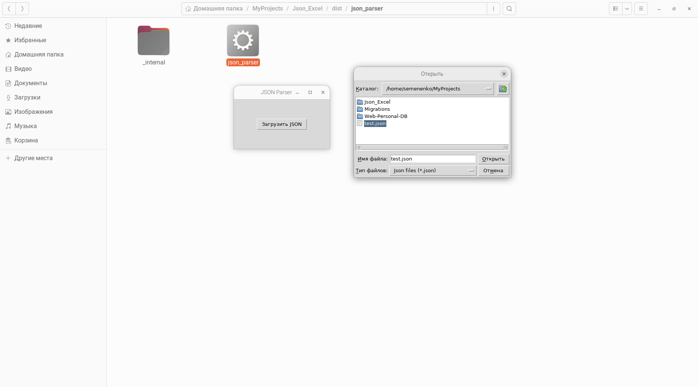

# Small JSON to XLSX Importer

## Script Description
This Python script is used to convert JSON data to an XLSX file and create an conlusion of data.
It uses the `openpyxl` library to create an XLSX file, the `json` library to parse the JSON data, and the `tkinter` library for the Tkinter GUI.
Python 3.10+ is required.

## Installation
Clone the repository: 
```
git clone https://github.com/waldesem/Json_Excel.git
````
Install the required dependencies: 
```
pip install -r requirements.txt
````
For building executable with folder data: 
```
pyinstaller --clean  --add-data="anketa.xlsx":. json_parser.py
```
or for one file (may be slow on startup executable):
```
pyinstaller --clean --add-data="anketa.xlsx":. --add-data="conclusion.xlsm":. --add-data="config.ini":. json_parser.py
```

## Usage
To configure the output folder change path in `config.ini`
Run the script: `python json_parser.py` 
Or executable: `json_parser.exe` from `Json_Excel/dist/json_parser` folder

## Screenshot


## License
This project is licensed under the MIT License.